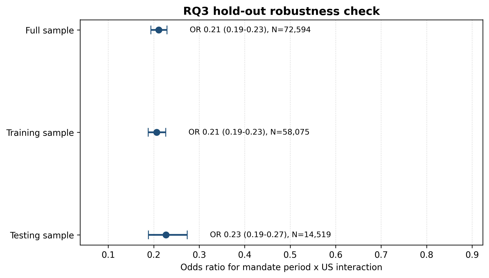

\newtheorem{theorem}{Theorem}

```{r setup, include=FALSE}
library(knitr)
library(kableExtra)
knitr::opts_chunk$set(echo = TRUE)
```

Project supervisor: Anthony Mays

# Declaration

In submitting this work I am indicating that I have read the University's Academic Integrity Policy. I declare that all material in this assessment is my own work except where there is clear acknowledgement and reference to the work of others. I give permission for this work to be reproduced and submitted to other academic staff for educational purposes.

# Abstract

This study investigates the relationship between sustained mask mandate periods and high mask-wearing behaviour during the COVID-19 pandemic, focusing on differences among United states (US) states and further comparing the association between Australia and the US. This is significant because mask policy is not only a public health intervention but also reflects the link between policy environment, regional differences, and personal protective behaviour.

This study uses data from the YouGov COVID-19 Behaviour Tracker and the Oxford COVID-19 Government Response Tracker. Methods employed include US state-level descriptive comparisons, a US logistic regression model, and an Australia–US interaction regression model.

Results show that in most US states with sustained mandate start dates, the high mask-wearing rate during the sustained mandate period was higher than before the mandate period, but the magnitude of the change differed significantly between states. US logistic regression results show an association between sustained mask mandate periods and higher mask-wearing odds; the Australia–US interaction model further indicates that this association differs between the US and Australia. 

Because this study uses observational survey data, the results should be interpreted as statistical associations rather than strict causal effects.

\newpage

# Introduction

During the COVID-19 pandemic, government mask policies were an important public health measure adopted by many countries to reduce the spread of the virus. However, whether a mask policy can increase mask-wearing rates depends not only on the policy itself, but also on factors such as local context, the duration of policy implementation, the strictness of the policy, and public attitudes. Previous studies have also shown that masks are not only a simple protective tool, but also have social, cultural, and political significance [@ref15_martinelli2020, p. 1].

Ryan et al. studied mask-wearing behaviour and protective health behaviours among Australians during the COVID-19 pandemic [@ref11_ryan2025]. Their study examined which factors predict whether people will wear masks and whether these predictive factors changed before and after the implementation of mask mandates, which means government requirements to wear face coverings in specified public settings. Their results indicate that mask-wearing behaviour was associated with a variety of factors, including policy period, survey timing, state differences, perceived disease risk, trust in government. This suggests that mask-wearing behaviour is not only related to individual attitudes, but also to regional context and the state-level policy environment.


While Ryan et al. provided an important analysis of the situation in Australia, the association between mask mandates and mask-wearing behaviour may not be the same across all countries and regions. Previous research has shown that mask-wearing behaviour varies across cultural contexts [@ref02_lu2021, p. 1] and also varies across different spatial and temporal contexts in the US[@ref09_taube2023, pp. 6--7]. This means that findings from a study conducted in one country may not directly describe the relationship between policy and behaviour in other countries.


The motivation for choosing Australia and the United States (US) for comparison is that both are federal countries composed of different states. During the pandemic, state governments in both countries implemented mask policies at different times and with different levels of strictness. This state-level variation provides a useful research context for comparing the association between sustained mask mandate periods and high mask-wearing behaviour.

Based on this, this study addresses the following research questions (RQs):

- **RQ1:** How do high mask-wearing rates vary across US states before and during sustained mandate periods?

- **RQ2:** Is a sustained mask mandate period associated with high mask-wearing behaviour in the United States?

- **RQ3:** Does the association between sustained mandate periods and high mask-wearing behaviour differ between Australia and the United States?

If the comparison shows that Australia and the US have similar patterns, it suggests that the pattern found by Ryan et al. in Australia may be replicable and applicable across borders. If different patterns are found, it indicates that the relationship between mask policies and mask-wearing behaviour may depend on national and regional contexts. Because this study uses observational survey data and policy data, rather than randomized experimental data, the results can only be interpreted as association, not as causal effect.

# Background

## Literature review

During the COVID-19 pandemic, mask-wearing became not only a personal protective measure but also an important public health policy in many countries and regions [@ref15_martinelli2020, pp. 1–2]. Previous studies have shown that mandatory mask-wearing policies were associated with higher public mask-wearing rates. Näher et al. conducted a retrospective event study using data from 51 countries and found that mandatory mask-wearing increased, on average, self-reported mask-wearing rates [@ref07_naher2024, pp. 1--2; @ref07_naher2024, p. 6]. This suggests an important association between mask policies and individual mask-wearing behaviour.

Existing studies have shown that mask-wearing behaviour is associated with many factors, including social norms, collectivism, cultural context, self-efficacy, and risk perception. Lu et al. found that collectivist culture predicted mask use during COVID-19 [@ref02_lu2021, p. 1], while Schumpe et al. showed that social and community-level norms were the most generalisable predictor across several public health outcomes [@ref04_schumpe2022, p. 6]. Yang et al. further argued that cross-country differences in mask-wearing cannot be explained only by epidemic severity, but also require attention to social norms, policy signals, and cultural factors [@ref06_yang2022, pp. 1--2]. Other studies also show that subjective norms, self-efficacy, perceived severity, perceived benefits, and perceived barriers can influence whether people adopt protective behaviours [@ref10_zhao2021, p. 1202; @ref03_jorgensen2021, p. 679; @ref05_white2022, p. 457].

In addition, mask-wearing behaviour also shows significant temporal and regional differences. Taylor et al. found that "pandemic fatigue" was characterised by a progressive decline over time in adherence to social-distancing guidelines and affected a minority of respondents in their US and Canadian sample [@ref01_taylor2022, p. 1]. MacIntyre et al. compared cities in Australia, the UK and the US and found that cities with mandatory mask-wearing policies generally had higher mask-wearing rates [@ref08_macintyre2021, pp. 199--200]. Taube et al. used more than 8 million US survey responses and found that mask-wearing behaviour in the US was highly uneven in space, with urban areas generally having higher rates than rural areas, and mask-wearing rates changing significantly over time [@ref09_taube2023, pp. 6--7]. These studies suggest that analyses of mask-wearing policies should account for temporal and regional variation, rather than treating policy-behaviour associations as uniform across places and periods.

Overall, existing research has shown that mask-wearing behaviour is related to public health policy, but is also influenced by social, cultural, psychological, temporal and regional factors [@ref07_naher2024, pp. 1--2; @ref02_lu2021, p. 1; @ref06_yang2022, pp. 1--2; @ref03_jorgensen2021, p. 679; @ref01_taylor2022, p. 1; @ref09_taube2023, pp. 6--7]. Therefore, the association between mask mandates and mask-wearing behaviour may vary across countries and regions. 

## Statistical background

### Logistic regression

Logistic regression is a statistical model commonly used for binary classification problems. Unlike linear regression, logistic regression does not directly model the probability. Instead, it first transforms the probability to the logit scale and then establishes the relationship between the explanatory variables and the outcome variables. This ensures that the probabilities predicted by the model always lie between 0 and 1 [@ref17_sperandei2014, pp. 13–15].

The general form can be written as:

\begin{equation}
\operatorname{logit}
\left[
\Pr(Y_i = 1)
\right]
=
\beta_0
+
\boldsymbol{\beta}^{\mathsf{T}}
\mathbf{X}_i,
\label{eq:general-logistic-regression}
\end{equation}

where \(Y_i\) is a binary outcome variable, with \(Y_i=1\) means that
observation \(i\) belongs to the target category. \(\mathbf{X}_i\) denotes a
set of explanatory variables; \(\beta_0\) is the intercept; and
\(\boldsymbol{\beta}\) is the vector of coefficients corresponding to the explanatory variables. A positive coefficient usually indicates that the variable is associated with increasing odds for the target category, whereas a negative coefficient indicates lower odds. To make the coefficients easier to interpret, logistic regression coefficients are often converted into odds ratios.

### Interaction model

Interaction model are used to examine whether the association between one
variable and an outcome changes depending on another variable.

In logistic regression, a general model with an interaction term can be written
as:

\begin{equation}
\operatorname{logit}
\left[
\Pr(Y_i = 1)
\right]
=
\beta_0
+
\beta_1 A_i
+
\beta_2 B_i
+
\beta_3(A_iB_i)
+
\boldsymbol{\beta}_X^{\mathsf{T}}
\mathbf{X}_i,
\label{eq:general-interaction-model}
\end{equation}

where \(A_i\) and \(B_i\) are two explanatory variables, \(A_iB_i\) is their
interaction term, and \(\mathbf{X}_i\) represents other control variables. The interaction coefficient \(\beta_3\) is used to assess whether the association between \(A_i\) and the outcome changes depending on \(B_i\). If the interaction coefficient is different from 0, this suggests that the association may differ between different groups.

### Key statistical terms

The logistic regression and interaction model results are interpreted using odds, odds ratios, 95\% confidence intervals, \(p\)-values and interaction terms. These terms are used to describe the direction, strength and statistical uncertainty of the estimated associations. A summary of these terms is provided in Appendix A.


# Methods

## Australian Replication

During Australian replication, the analytical framework proposed by Ryan et al. [@ref11_ryan2025] was reproduced using the Australian YouGov COVID-19 Behaviour Tracker survey data [@ref12_jones2020] together with policy data from the Oxford COVID-19 Government Response Tracker (OxCGRT) [@ref13_hale2021]. The replication included data preprocessing, variables construction, and machine learning models to predict individual mask-wearing behaviour before and after the implementation of the mask mandate, with the aim of comparing whether the key predictors changed between the two policy periods. The replication results were broadly consistent with those reported by Ryan et al.

## Research Gap

Based on the Australian replication and literature reviewed above, existing studies have focused on either single-country analyses, broad cross-country comparisons, or selected city-level comparisons. Less attention has been given to whether sustained state-level mask mandate periods are associated with high mask-wearing behaviour in the US, and whether this association differs from the association observed in Australia. 


##  Study Design 

Based on this gap, this study extends the analysis to US data and further compares whether there are differences in the relationship between sustained mask mandate period and high mask-wearing behaviour between Australia and the US. This study focuses not on predictive model performance, but rather on using descriptive analyses and interpretable statistical models to investigate the adjusted association between policy periods and individual mask-wearing behaviour. Figure \ref{fig:study-design} summarises the overall analytical workflow.

\begin{figure}[!ht]
\centering
\includegraphics[width=0.85\textwidth]{design_overview_4.pdf}
\caption{Analytical framework}
\label{fig:study-design}
\end{figure}

##  Data Sources

### YouGov COVID-19 Behaviour Tracker

This dataset contains individual-level COVID-19 behaviour survey information from 29 countries from March 2020 to March 2022, including demographic variables, health-related variables, protective behaviour items, mental health items, government trust-related variables, and survey dates. It comes from the YouGov COVID-19 Behaviour Tracker dataset, jointly released by Imperial College London and YouGov[@ref12_jones2020]. The Australian data comes from the cleaned and preprocessed Australian replication dataset in Part A. The US data comes from `united-states.csv`, which provides country-specific survey records for each participating country.

### Oxford COVID-19 Government Response Tracker (OxCGRT)\label{sec:oxcgrt}

The policy document used in this study is `OxCGRT_compact_subnational_v1.csv`, which records the COVID-19 mask policies and measures implemented in multiple countries and regions from January 2020 to December 2022, including lockdown policies, health policies, vaccine policies, and mask policies. It comes from the Oxford COVID-19 Government Response Tracker (OxCGRT) policy data[@ref13_hale2021]. 

Since the purpose of this study is to examine the association between mandatory mask orders and mask-wearing behaviour, this study focuses on policies related to face coverings (column identifier H6). H6M Facial Coverings represents government policy requirements for the use of masks or face coverings outside the home, and is an ordinal variable with values from 0 to 4, representing no policy, recommended wearing, required wearing in designated public places, required wearing in all public places or situations where social distancing cannot be maintained, and required wearing in all situations outside the home, respectively.


## US YouGov data processing \label{sec:Measures}

### Missing values

First, the raw survey data underwent a missing value check. After the raw data was read, missing values were identified for all variables. Empty strings, fields containing only spaces, and missing markers from the data source (such as "NA") were all considered missing values (\path{0_missing_table_usa.py}, lines 14-20).

For each variable, the number of missing values and the missing percentage were calculated, where the missing percentage was defined as the proportion of missing observations to the total number of observations in the raw data. This step was only used to assess the data integrity of the variables and generate missing value statistics (\path{0_missing_table_usa.py}, lines 22-27).

Subsequently, following the variable screening logic in Ryan et al. [@ref11_ryan2025]'s Australian analysis, variables with a missing percentage exceeding 20\% were initially removed; it means variables with more than 6,788 missing values were removed (\path{1_clean_dataset_usa.py}, lines 51-52). However, core variables relevant to the research question, model adjustment, and cross-country comparisons were retained for subsequent processing, even if their missing percentage exceeded this threshold (1_clean_dataset_usa.py, lines 54-83). The missing-value summary are recorded in Appendix B.1.

### Face mask wearing\label{sec:face-mask-wearing}

The mask-wearing behaviour variable was used to construct the primary outcome variable of this study. This variable was constructed based on four mask-wearing items from the YouGov survey (see Appendix B.2):  

\begin{itemize}
    \item wearing masks outside the home;
    \item wearing masks inside grocery stores/supermarkets;
    \item wearing masks inside clothing/footwear shops; and
    \item wearing masks on public transportation.
\end{itemize} 

First, the responses to the four items were converted into a uniform five-point frequency scale, where: Always = 5; Frequently = 4; Sometimes = 3; Rarely = 2; Not at all = 1 (\path{1_clean_dataset_usa.py}, lines 95-101). For each observation, the median of valid responses to the four items was calculated, constructing a face mask-wearing frequency scale (lines 108-116). Because this study aimed to compare data from the US and Australia, the median used by Ryan et al. was adopted for calculation (line 118-121).

Then, following the standard set by Ryan et al. [@ref11_ryan2025], observations with a median of 4 or higher were defined as the high mask-wearing group and coded as 1; observations with a median of less than 4 were coded as 0 (lines 123-125).

### Non-mask protective behaviour\label{sec:Non-mask protective behaviour}

To control for respondents' general protective behaviours other than mask wearing, this study further constructed an indicator of non-mask protective behaviour.

First, the remaining protective behaviour items were coded using the same five-point frequency scale as the mask wearing item mentioned above (\path{1_clean_dataset_usa.py}, line 127-131). Then, the median of all valid protective behaviour items for each respondent was calculated to construct a protective behaviour indicator, `protective_behaviour_scale`, which represents the overall protective behaviour scale (line 133-140).

Since mask wearing behaviour is the primary outcome variable, including mask-related items in the protective behaviour indicator could lead to duplicate information between explanatory and outcome variables in the model. Therefore, when constructing the non-mask protective behaviour indicator for control in the regression model, this study removed the four mask wearing items mentioned above and only used other protective behaviour items to calculate `protective_behaviour_nomask_scale`, representing the non-mask protective behaviour scale (line 142-150).

This indicator controls for individuals' overall protective tendencies without considering mask use, such as reducing contact, isolation, or other preventative behaviours, thereby avoiding confusion between general protective awareness and mask wearing behaviour (The specific items and corresponding behavioural meanings are shown in Appendix B.3).


### Covariates

This study selects control variables based on the research question and the model specification in Ryan et al. [@ref11_ryan2025]'s analysis of Australia, including demographic characteristics, health-related variables, government trust variables, and mental health variables.

The household size variable was converted to a numeric variable, with values for 1 to 7 family members retained. "8 or more" was coded as 8, while "Prefer not to say," "Don't know," and missing responses were treated as missing values (\path{1_clean_dataset_usa.py}, lines 18-34).

The age variable was retained as a continuous numeric variable. Gender and employment status were treated as categorical variables (line 54-83).

### Time index

To control for variations in the survey period, this study reconstructed the time variable instead of directly using the original survey week variable, `qweek`.

First, the earliest survey date in the US YouGov database was used as the starting point. Then, based on the time difference between the respondents' survey date and the starting date, the entire survey period was divided into consecutive 14-day intervals. The first 14-day interval was coded as 1, and the code increased by 1 for each subsequent new 14-day interval (\path{1_clean_dataset_usa.py}, line 155-157).

### Analytical sample

After variable cleaning and construction, the final sample for subsequent statistical analysis was determined.

Records were retained only when valid information was available for state, survey completion date, the mask-wearing scale, the binary
mask-wearing outcome, the non-mask protective behaviour measure, gender, age,
household size and employment status (\path{1_clean_dataset_usa.py}, line 159-174). Records lacking any of the above key variables were deleted. 

Then, remove original variables that have been used to construct new variables and are no longer needed, including: original qweek time variables; original mask-wearing items; weights not used in subsequent models (line 176-1780).The sample-selection process is summarised in Appendix B.4.

The final cleaned US survey dataset is saved as `cleaned_data_usa.csv`, which is used for subsequent linking with the state-level sustained mask mandate start date and for further model preprocessing.

## OxCGRT policy data processing \label{sec:government-mandates}

### US policy data 

US state-level policy data were extracted from OxCGRT compact subnational policy dataset (\path{000_filter_us_policy.py}, line 15). Because this study investigates the association between state-level mask mandate policies and individual mask-wearing behaviour in the US, the dataset was restricted to state-level policy records from the US (line 18). National-level records and policy observations from other jurisdictions were excluded.

The filtered dataset retained seven variables: country name, country code, region name, region code, jurisdiction level, policy date, and the H6M Facial Coverings indicator (line 23-32). Among them, the region name is used to distinguish different states, the policy date is used to establish the policy timeline for each state, and the H6M Facial Coverings indicator is used to indicate the strictness of the mask policy on that day(see Section \ref{sec:oxcgrt}). The processed US state-level policy data is saved as `OxCGRT_US_latest.csv`. A summary of `OxCGRT_US_latest.csv` in Appendix C.1.

### Sustained mandate start date \label{sec:sustained-mandate-start-date}

First, this study read the file `OxCGRT_US_latest.csv`, converted the Date data to datetime format, and set a time index (\path{00_mask_mandates_usa.py}, line 14-21). Then, this study grouped data by state. The purpose of this was to ensure that changes to mask policies in each state were calculated separately within that state, rather than mixing policy records from different states together. After grouping by state, this study calculated a 14-day rolling average of the strictness of mask policies for each state (line 23-27).

The 14-day rolling average means that for each day, this study uses the policy strictness records of that day and the preceding 13 days to calculate the average level over those 14 days. The reason for using a 14-day rolling average is that daily policy records can be affected by short-term adjustments, temporary changes, or data fluctuations. Using only the policy value of a single day might misinterpret short-term or sporadic policy changes as sustained mask mandates. Therefore, the 14-day rolling average provides a more stable reflection of whether a state has truly entered a sustained mask policy phase.

After calculating the rolling average, 3 was set as the threshold for identifying sustained mask mandates (line 29-33). For each state, the date on which the 14-day rolling average first occurred greater than or equal to 3 was defined as the state's sustained mask mandate start date. This threshold follows the policy definition in Ryan et al.'s Australian analysis to ensure comparability of the results from the two analyses.

Finally, only the start date when each state first met the condition was retained and saved as `us_mandate_start_dates.csv`. See Appendix C.2 for the sustained mask mandate start dates identified by each state.

### Mandate-period indicator \label{sec:mandate-period-indicator}

First, the sustained mask mandate start dates identified in the previous section \ref{sec:sustained-mandate-start-date} are matched against the individual survey data processed in \ref{sec:Measures} based on the respondents' reported state of residence (\path{3_data_preprocessing_usa.py}, line 50-56). Before merging, the District of Columbia naming in both the survey and policy data is standardized to ensure correct matching (line 36-39).

The sustained mask mandate indicator was coded as follows (line 15-24):

\begin{itemize}
    \item Survey date on or after the state's mandate start date: 1;
    \item Survey date before the state's mandate start date: 0; and
    \item No identified state mandate start date: 0.
\end{itemize} 

After constructing the sustained mask mandate period indicator, the state name and start date fields used for data matching are deleted (line 76-79), retaining only the final constructed binary sustained mask mandate period indicator for subsequent state-level descriptive and regression analyses.

## RQ1: State-level comparison\label{sec:state-descriptive-methods}

To describe the changes in mask-wearing rates before and after sustained mask mandates across different U.S. states, this study conducted state-level descriptive comparisons. This analysis was intended to demonstrate observed differences in mask-wearing behaviour between states and was not intended to estimate the causal effects of mask policies.


**Step 1: Selection of indicators and state-period grouping.** The binary
high mask-wearing indicator constructed in Section\ref{sec:face-mask-wearing} (\path{2_state_level_descriptive_comparison.py}, line 28-44)and the sustained mandate-period indicator constructed in Section \ref{sec:mandate-period-indicator} (line 51-64) were used in the state-level comparison analysis. Respondents were grouped according to their reported state and mandate-period status. For each state, respondents were grouped as either before the sustained mandate period or during the sustained mandate period. States without an identified sustained mandate start date had no during-mandate group (line 68-73).


**Step 2: Calculation of state-period proportions.** For each state-period group, the total number of respondents, the number classified as having high mask-wearing frequency, and the observed proportion with high mask-wearing frequency were calculated (line 82-134).

For state \(s\) in mandate-period category \(m\), the observed proportion with high mask-wearing frequency was calculated as

\begin{equation}
\widehat{P}_{s,m}
=
\frac{K_{s,m}}{N_{s,m}},
\label{eq:state-period-proportion}
\end{equation}

where \(\widehat{P}_{s,m}\) denotes the observed high mask-wearing proportion
in state \(s\) during mandate-period category \(m\);
\(K_{s,m}\) is the number of respondents classified as having high
mask-wearing frequency in that state-period group; and \(N_{s,m}\) is the
total number of respondents in the same group. The period category \(m\)
corresponds to the value of the individual mandate-period indicator:
\(m=0\) denotes the pre-mandate period and \(m=1\) denotes the sustained
mandate period for states with an identified onset date.


**Step 3: Calculation of within-state proportional change.** For each state with respondents before and during an identified sustained mandate period, the proportional change in high mask-wearing was calculated by comparing the during-mandate proportion with the corresponding pre-mandate proportion (line 136-151):

\begin{equation}
R_s
=
100
\left(
\frac{
\widehat{P}_{s,1}-\widehat{P}_{s,0}
}{
\widehat{P}_{s,0}
}
\right),
\label{eq:state-proportional-change}
\end{equation}

where \(R_s\) denotes the percentage change in the observed high
mask-wearing proportion in state \(s\);
\(\widehat{P}_{s,0}\) is the observed pre-mandate proportion; and
\(\widehat{P}_{s,1}\) is the observed proportion during the sustained mandate
period. Positive values of \(R_s\) indicate a higher observed proportion
during the sustained mandate period, whereas negative values indicate a lower
observed proportion.

States without an identified sustained mandate start date were excluded from
the proportional-change figure because no during-mandate proportion could be
calculated for these states (line 133-134). State-period sample sizes and observed proportions are reported in Appendix D.1.

## RQ2: US logistic regression

To estimate the adjusted association between the period of the sustained mask mandate and high-frequency mask-wearing behaviour in the US sample, this study used a logistic regression model. The specific steps are as follows.

**Step 1: Outcome coding.** The mask-wearing behaviour variable constructed in Section \ref{sec:face-mask-wearing} was recoded as a binary dependent variable. High mask-wearing behaviour was coded as 1, and all other cases were coded as 0(\path{4_basic_logistic_usa.py}, lines 26–30). 

**Step 2: Exposure definition.** The sustained mask mandate period indicator constructed in Section \ref{sec:mandate-period-indicator} was used as the main explanatory variable for the model, where 1 indicates that the respondents completed the survey during the sustained mask mandate period, and 0 indicates other circumstances (lines 32–43).

**Step 3: Covariate preparation.** Before modeling, all categorical variables were converted to dummy variables (lines 50--68). The categorical variables included: gender; employment status; previous health status; vaccination willingness; evaluation of the government response; confidence in government; and PHQ-4 items.

Each categorical variable retained a reference category, and the remaining categories were converted to binary indicator variables to avoid perfect multicollinearity. Numerical control variables included age; household size; number of children in the household; three health-related indicators; and protective behaviour without a mask (lines 32–43) . 

**Step 4: Construction of the model-specific sample.** Then, all variables are converted to numerical values (line 75-79). If any model variable has missing values, the corresponding observation is deleted (line 81-85).

The US model was specified as:

\begin{equation}
\operatorname{logit}
\left[
\Pr\left(Y_i=1\right)
\right]
=
\beta_0
+
\beta_M M_i
+
\boldsymbol{\beta}_X^{\mathsf{T}}
\mathbf{X}_i,
\label{eq:us-adjusted-logistic}
\end{equation}

where \(Y_i\) denotes the binary high mask-wearing outcome for respondent
\(i\); \(M_i\) denotes the respondent's sustained mandate-period status;
\(\mathbf{X}_i\) is the vector containing the included covariates and the
fortnight time term; \(\beta_0\) is the intercept; \(\beta_M\) is the
log-odds coefficient for sustained mandate-period exposure; and
\(\boldsymbol{\beta}_X\) is the vector of coefficients corresponding to the
included covariates.

**Step 5: Model estimation and reporting.** An intercept was included, and
the logistic regression model was estimated by maximum likelihood. The
numerical optimisation procedure was permitted a maximum of 200 iterations (line 87-92).


**Step 6: Robustness check.** To examine whether the main results of the US Logistic Regression model are relatively stable for sample partitioning, this study further conducted a hold-out robustness check. This robustness check used the same modeling data, dependent variable, principal explanatory variables, and control variables as the main model.

First, the full-case modeling sample was randomly divided into training and testing samples. This study used an 80/20 hold-out split, meaning 80% of the records were used as the training sample and 20% as the testing sample. The random seed was set to 20240417 to ensure reproducibility. Simultaneously, stratified sampling was used according to the dependent variable to make the proportion of high mask-wearing in the training and testing samples as close as possible.(\path{4b_rq2_holdout_robustness_usa.py}, line 111-120)

Then, this study fitted the same Logistic Regression model to the full sample, training sample, and testing sample (line 122-148). For each model, the regression coefficients, odds ratio, 95% confidence interval, and two-sided p-values were saved. Here, the testing sample is not only used for prediction, but is also fitted with a logistic regression separately to check whether the estimated direction, odds ratio, and statistical significance of the sustained mandate-period indicator are consistent across different samples.


## RQ3: Australia-US harmonisation and interaction model \label{sec:aus-us-interaction}

To examine whether the association between sustained mask mandate periods and
high mask-wearing differed between Australia and the US, the data were harmonised before fitted the interaction model. The procedure comprised the following steps:

**Step 1: Country identification.** A country label was added to each respondent record before the two datasets were combined. Australian records were labelled as Australia and US records as US. (\path{5_prepare_combined_aus_us.py}, line 30-35)

**Step 2: Outcome harmonisation.** In both datasets, respondents classified as having high mask-wearing frequency were coded 1, and respondents in the comparison category were coded 0 (line 37-49). This produced a common binary outcome, denoted by \(Y_i\), for respondent \(i\).

**Step 3: Mandate-period harmonisation.** The individual-level sustained mandate-period indicator was converted to numeric form in both datasets. Respondents recorded during a sustained mandate period were coded 1, others were coded 0.(line 51-63)

**Step 4: Selection of common numeric covariates.** Only numeric variables
available in both country datasets were eligible for inclusion in the harmonised dataset. The common numeric covariates were age, household size,
health-related variables and the non-mask protective behaviour measure. Variables not available in both datasets were removed. (line 65-87)

**Step 5: Selection of comparable categorical indicators.** The binary indicators in both datasets include gender, employment status, previous health status, vaccination willingness, evaluation of the government response, confidence in government, and the PHQ-4 items. However, only indicator columns representing the same response category and present in both datasets were retained. Then, country-specific indicator categories not present in both dataset were excluded (line 92-127). The complete mapping is shown in Appendix F.

**Step 6: Dataset combination.** Then the Australian and US data were restricted to the same variable columns, merged by row, and combined into a single dataset for individual-level joint analysis (line 129-142).

**Step 7: Country and interaction coding.**  After that a binary country indicator,\(G_i\), was coded 0 for Australia and 1 for the US (line 144-152). The product \(M_iG_i\) was then constructed to represent the interaction between mandate-period exposure and country.

The country indicator was defined as

\begin{equation}
G_i =
\begin{cases}
0, & \text{if respondent } i \text{ was from Australia},\\
1, & \text{if respondent } i \text{ was from the United States}.
\end{cases}
\label{eq:country-indicator}
\end{equation}

The country-by-mandate interaction term was constructed as \(M_iG_i\), where
\(M_i\) denotes the individual-level sustained mandate-period indicator. It is coded 1 if respondent \(i\)'s survey record occurred during a sustained mandate period, and 0 otherwise.

**Step 8: Core Variable Completeness Screening.** Convert the four core variables into numerical variables, including outcome variables, policy period variables, country variables, and interaction terms. If missing values exist in these variables, remove them from the merged dataset (line 155-170).


**Step 9: Interaction logistic regression model.** After constructing the
harmonised Australia--US dataset, a binary logistic regression model was fitted.

The model was specified as

\begin{equation}
\operatorname{logit}
\left[
\Pr\left(Y_i=1\right)
\right]
=
\theta_0
+
\theta_M M_i
+
\theta_G G_i
+
\theta_{MG}\left(M_iG_i\right)
+
\boldsymbol{\theta}_X^{\mathsf{T}}
\mathbf{X}_i,
\label{eq:country-interaction-model}
\end{equation}

where \(Y_i\) denotes the binary high mask-wearing outcome for respondent
\(i\); \(M_i\) is the sustained mandate-period indicator; \(G_i\) is the
country indicator; \(M_iG_i\) is the country-by-mandate interaction;
\(\mathbf{X}_i\) is the vector of common covariates; \(\theta_0\) is the
intercept; \(\theta_M\) is the mandate-period log-odds coefficient for
Australia; \(\theta_G\) is the US--Australia log-odds difference when
\(M_i=0\); \(\theta_{MG}\) is the difference between the US and Australian
mandate-period log-odds associations; and
\(\boldsymbol{\theta}_X\) is the vector of covariate coefficients.


**Step 10: Model estimation and reporting.** An intercept was included, and
the logistic regression model was estimated by maximum likelihood. The
numerical optimisation procedure was permitted a maximum of 300 iterations.(\path{6_country_interaction_model.py}, line 89-109)


**Step 11: Robustness check.** To verify whether the results of the Australia-US interaction model are stable for sample partitioning, this study further performed a hold-out robustness check. This robustness check used the same harmonized Australia-US dataset as the main interaction model and maintained the same model variable structure.

First, the full modeling samples were randomly divided into training and testing samples. This study uses an 80/20 hold-out split, meaning 80% of the records are used as training samples and 20% as testing samples. The random seed was set to 20240417 to ensure the same sample partitioning for each run. The sample partitioning was stratified by "country + high mask-wearing outcome," ensuring that the proportions of Australia/US and high mask-wearing outcomes in the training and testing samples remained similar.(\path{6b_rq3_holdout_robustness_interaction.py}, line 131-147)

Then, this study fitted the same configured interaction logistic regression model to the full sample, training sample, and testing sample.(line 149-174) The regression coefficients, odds ratios, 95% confidence intervals, and two-sided p-values of all variables are preserved.

# Results

## Data preparation

### US Policy data and mandate start date

After applying the policy data processing and mandate-date construction
described in Section \ref{sec:government-mandates}, the filtered OxCGRT subnational policy data contained 55,896 US state-day records covering all 50 states and the District of Columbia. The retained policy data contained no missing H6M values. Additional information on the temporal coverage and completeness of the policy data is provided in Appendix C.1.

Of the 51 US states and jurisdictions included in the policy data, 47 reached the prespecified sustained mandate threshold. No sustained mandate onset date was identified for Minnesota, Nebraska, South Dakota or Wyoming because their 14-day rolling mean policy stringency did not reach the threshold of 3. Among the remaining jurisdictions, the identified onset dates ranged from 19 April 2020 to 13 September 2021. State-specific onset dates are reported in Appendix C.2.

### US YouGov survey sample

After applying the data processing and measure construction steps described in
Section \ref{sec:Measures}, the original US survey dataset contained 33,940 records and 424 variables. After missing value filtering, variable selection, and complete case filtering, the final US survey sample included 32,458 respondents from all 50 states and the District of Columbia. The survey completion dates ranged from April 2, 2020, to October 15, 2021. Of the cleaned sample, 20,477 respondents (63.09%) were categorized as high mask-wearing, while the remaining 11,981 (36.91%) were in the comparison category. A summary of the cleaning steps is provided in Appendix B.5.


## RQ1: State-level comparison

The state-level descriptive comparison showed (Figure \ref{fig:state-change}) that among the 47 states with an identified sustained mandate start date,33 had a higher observed proportion of high mask-wearing during the sustained mandate period than before its start date, while 14 had a lower observed proportion. State-level proportional changes ranged from \(-11.95\%\) in Colorado to \(225.00\%\). Montana  Minnesota, Nebraska, South Dakota and Wyoming
had no identified sustained mandate start date. Complete state-period sample sizes and proportions are reported in Appendices C.1 and C.2.

\begin{figure}[H]
\centering
\includegraphics[width=0.90\textwidth]{PartB_US_Extension/results/02_state_level_descriptive_comparison.png}
\caption{State-level proportional change in high mask-wearing during sustained mandate periods.}
\label{fig:state-change}
\end{figure}

## RQ2: US logistic regression

The key estimate is reported in Table\ref{tab:us-logistic-key}, and the complete model estimates are reported in Appendix E.

```{r us-logistic-key-table,echo=FALSE,message=FALSE,warning=FALSE}
library(dplyr)
library(knitr)
library(kableExtra)

us_results <- read.csv(
  "PartB_US_Extension/results/04_basic_logistic_usa_results.csv",
  check.names = FALSE
)

us_key_table <- us_results |>
  filter(variable == "within_mandate_period") |>
  transmute(
    Effect = "Sustained mandate-period association",
    `Model sample` = "26,176",
    `Adjusted odds ratio` = sprintf("%.3f", odds_ratio),
    `95% confidence interval` = paste0(
      sprintf("%.3f", ci_lower),
      " to ",
      sprintf("%.3f", ci_upper)
    ),
    `p-value` = ifelse(
      p_value < 0.001,
      "<0.001",
      sprintf("%.3f", p_value)
    )
  )

us_key_table |>
  kable(
    format = "latex",
    caption = "Key estimate of the US logistic regression.",
    label = "us-logistic-key",
    align = c("l", "r", "r", "r", "r"),
    booktabs = TRUE
  ) |>
  kable_styling(
    latex_options = c(
      "hold_position",
      "scale_down"
    ),
    font_size = 9
  )
```

### US model robustness check

The US model sample was divided into 20,940 training observations and 5,236 testing observations (see Appendix G.1). The adjusted mandate-period odds ratio can be find in Figure \ref{fig:rq2-holdout-forest}. Detailed coefficient estimates are reported in Appendix G.2.

```{r rq2-holdout-forest, echo=FALSE,  fig.align="center",fig.pos="H", out.width="85%",fig.cap="Mandate-period odds ratios in the full, training and testing US samples."}
knitr::include_graphics(
  paste0(
    "PartB_US_Extension/results/",
    "04c_rq2_holdout_or_forest_plot.png"
  )
)
```


## RQ3: Australia-US harmonisation and interaction model

The harmonised Australia-US dataset contained 72,594 respondent records:
40,136 from Australia and 32,458 from the US (see Appendix F.2). In this dataset, high mask-wearing was observed in 53.96% of Australian records and 63.09% of US records. Sustained mandate-period observations accounted for 62.76% of Australian records and 68.69% of US records.

With Australia as the reference country, the key estimates are reported in Table \ref{tab:country-interaction-key}.

```{r country-interaction-key-table,echo=FALSE,message=FALSE,warning=FALSE}
library(dplyr)
library(knitr)
library(kableExtra)

interaction_results <- read.csv(
  "PartB_US_Extension/results/06_country_interaction_key_results.csv",
  check.names = FALSE
)

term_labels <- c(
  "within_mandate_period" =
    "Mandate period: Australia",
  "country_US" =
    "Country: US vs Australia at mandate = 0",
  "mandate_x_US" =
    "Country-by-mandate interaction"
)

key_table <- interaction_results |>
  mutate(
    Term = unname(term_labels[variable]),
    `Adjusted odds ratio` = sprintf("%.3f", odds_ratio),
    `95% confidence interval` = paste0(
      sprintf("%.3f", ci_lower),
      " to ",
      sprintf("%.3f", ci_upper)
    ),
    `p-value` = ifelse(
      p_value < 0.001,
      "<0.001",
      sprintf("%.3f", p_value)
    )
  ) |>
  select(
    Term,
    `Adjusted odds ratio`,
    `95% confidence interval`,
    `p-value`
  )

key_table |>
  kable(
    format = "latex",
    caption = "Key estimates of the Australia--US interaction model.",
    label = "country-interaction-key",
    align = c("l", "r", "r", "r"),
    booktabs = TRUE
  ) |>
  kable_styling(
    latex_options = c(
      "hold_position",
      "scale_down"
    ),
    font_size = 9
  )
```


### Interaction model robustness check

The full interaction-model sample contained 72,594 respondents, of whom
58,075 were allocated to the training sample and 14,519 to the testing sample (see Appendix G.1). The adjusted country-by-mandate interaction odds ratio can be find in Figure \ref{fig:rq3-holdout-forest}. Detailed coefficient estimates are reported in Appendix G.3.

```{r rq3-holdout-forest,echo=FALSE,message=FALSE,warning=FALSE,fig.cap="Country-by-mandate interaction estimates in the full, training and testing samples.",fig.align="center",out.width="82%",fig.pos="H"}


```

# Discussion

##  Main findings

The following are the main findings corresponding to the three research questions in this study:

### RQ1: State-level comparison

The results suggest that high mask-wearing rates generally increased during sustained mandate periods in most US states and the state-level proportional change ranged widely. This indicates that there is significant state-level heterogeneity and inconsistency in changes in mask-wearing before and after the mandate period across different US states.

### RQ2: US logistic regression

The results showed that even after controlling for confounding factors such as demographic characteristics, health status, other protective behaviours and survey duration, a positive association remains between the mandate period and higher frequency of mask-wearing. This indicates that even after considering multiple factors that may influence residents' behaviour, the sustained mask mandate remains stably associated with higher levels of mask-wearing behaviour.

Robustness tests showed that the association direction remained consistent across the complete sample, training sample, and test sample, indicating that this positive correlation was not caused by a single sample division. However, this study is an observational study and can only demonstrate a statistical association between the period of mandatory mask-wearing and high-frequency mask-wearing behaviour, but cannot infer a direct causal relationship between the two.

### RQ3: Australia-US interaction model

The results show that this association is positive in both countries, but the association is much weaker in the US than in Australia. This result suggests that the policy-behaviour relationship in the Australian replication framework cannot be simply generalized to the US, because there are significant differences in the policy environment and behavioural response patterns between the two countries. This difference may reflect variation in policy implementation, state-level governance, public attitudes, social norms and behavioural responses between the two countries.

The robustness checks showed a consistent direction across the full, training and testing samples, which supports the stability of this overall pattern.  However, this result should still be interpreted as a difference in cross-national statistical association, rather than a strict causal effect.

## Comparison with existing literature

These findings are consistent with existing literature. The state-level differences found in RQ1 are consistent with evidence that US mask-wearing varied across time and space [@ref09_taube2023, pp. 1-2]. The RQ2 finding that sustained mask mandate periods were associated with higher mask-wearing rates is consistent with previous evidence [@ref07_naher2024, p. 6; @ref08_macintyre2021, p. 205; @ref14_haischer2020, pp. 7–8]. The differences between Australia and the US in RQ3 are consistent with evidence that mask acceptance varies with cultural and socio-cultural contexts, including collectivism, social norms, policy signals, and local policy environments [@ref02_lu2021, p. 1; @ref06_yang2022, pp. 1-2].

## Study contribution

The main contribution of this study is that it extends the research to the US based on the Australian analytical framework of Ryan et al., uses a relatively transparent and interpretable method, and finally uses a robustness check to test the reliability and stability of the results.


## Limitations and future directions

### Self-reported behaviour

The high mask-wearing outcome in this study was derived from respondents’ self-reports in the YouGov COVID-19 Behaviour Tracker, recall bias and social desirability bias may exist [@ref16_hutchins2020, p. 1587]. During the pandemic, mask-wearing is not only a personal protective behaviour but may also be influenced by social norms and politics. Therefore, when comparing different states or countries, different regional social norms may influence the way self-reporting is conducted.

Future research could use more diverse data sources, such as mobile behaviour data, observational public space data, or other data that indirectly reflect actual mask-wearing behaviour. This can reduce recall bias and social desirability bias arising from relying solely on self-reporting.

### Median-based outcome

To maintain consistency with the Australian analysis conducted by Ryan et al., the primary dependent variable of high mask-wearing was constructed by calculating the median of each respondent's valid responses to four questions, defining respondents with a median of 4 or higher as the high mask-wearing group. (See Appendix B.2 for the specific four questions.) However, the median is insensitive to extreme values[@ref19_mishra2019, p. 68], which may therefore overlook differences in mask-wearing behaviour across different scenarios.

Future research could compare different outcome construction methods. For example, median-based scales, mean-based scales, and total scores can be used simultaneously to define high mask-wearing. If different construction methods yield similar conclusions, the results will be more convincing; if the results differ significantly, further investigation can be conducted to explore how the measurement method of mask-wearing behaviour affects the model results.

### Association, not causation

The model results in this study should be interpreted as statistical associations, not causal effects. Although the models controlled for covariates such as demographics, household structure, health-related variables, non-mask protective behaviour, and survey duration, this study used observational cross-sectional survey data and employed conventional logistic regression and Australia-US interaction logistic regression. Therefore, the results cannot demonstrate that sustained mask mandate periods directly caused higher mask-wearing behaviour [@ref18_hammerton2021, pp. 563–566].

Future research could use stronger causal identification methods. For example, state fixed effects can be incorporated to control for stable differences between states, or difference-in-differences methods can be used to compare changes before and after policy implementation. This would allow for a more rigorous discussion of the causal impact of mask mandate on mask-wearing behaviour.

### Limited Country Comparison

This study's country-level comparison included only Australia and the US, so the generalisability of the findings to other countries is limited [@ref20_franke2010, p. 1275]. Although the Australia-US interaction model can compare the strength of the association between sustained mandate period and high mask-wearing between the two countries, this comparison is still limited by the limited number of countries.

Future research could extend the comparison to additional countries or regions, thereby testing whether the findings observed in Australia and the US also apply in broader international contexts [@ref20_franke2010, p. 1284].

# Conclusion

This study investigates the association between sustained mask mandate periods and high mask-wearing behavior. It first conducts descriptive comparisons between US states, then estimates the association using a US logistic regression model, and finally compares whether this association differs between the two countries using an Australia–US interaction model. Overall, the results show a positive association between sustained mandate periods and higher mask-wearing behavior, but this association varies significantly across different US states and its strength differs between the US and Australia.


# Acknowledgements

I would like to thank the teaching team and classmates for their help, feedback, and support throughout the project. Their suggestions helped me further clarify the research question, improve the analytical structure, and better understand how to interpret the research methods and results.

I also acknowledge that I used AI tools to assist in language polishing, expression modification, and code understanding during the preparation of this study. However, the research design, data processing, model analysis, results interpretation, and final writing decisions were all completed and reviewed by myself.

All code used in this study can be found in the OneDrive folder \path{Anthony Mays-Covid_Ma_J/PartB_US_Extension/code}. The full script name will be used the first time the code is cited in the text; if the same script is cited again later, only the relevant line number will be used to avoid duplication and save words.

All code, data-processing scripts, and supporting materials used to reproduce the analyses and results in this report are available at: <https://github.com/mjyhub/MDSresearch_FinalReport_Ma_J>

# References

<div id="refs"></div>

\newpage

# Statistical appendix


## Appendix A: Key statistical terms

\begin{table}[ht]
\centering
\small
\caption{Key statistical terms used in model interpretation.}
\label{tab:key-statistical-terms}
\begin{tabularx}{\textwidth}{p{0.22\textwidth} p{0.18\textwidth} X}
\hline
Term & Formula & Interpretation \\
\hline
Odds & \(p/(1-p)\) & The relative probability of an event occurring rather than not occurring, where \(p\) is the probability of the event. Larger odds indicate that the event is more likely to occur. \\

Odds ratio (OR) & \(\exp(\beta)\) & The relative change in odds associated with a predictor,where \(\beta\) is the logistic regression coefficient. OR>1 indicates higher odds, OR<1 indicates lower odds, and OR=1 indicates no difference in odds. \\

95\% confidence interval & \([L,U]\) & The uncertainty range around an estimate. For an OR, if the interval includes 1, the evidence for an association is weaker. If the interval is entirely above or below 1, the association is more statistically supported. \\

\(p\)-value & Reported by model & Evidence against the null hypothesis. Smaller values provide stronger evidence against no association. \\

Interaction term & \(A \times B\) & Tests whether the association between \(A\) and the outcome changes depending on \(B\).  If the interaction OR is close to 1, it indicates a small difference in association between the two groups; if interaction OR > 1, it indicates a stronger association in the target group compared to the reference group; if interaction OR < 1, it indicates a weaker association in the target group. \\
\hline
\end{tabularx}
\end{table}


## Appendix B: US YouGov data processing

### Appendix B.1: Missing-value summary

Source: Generated from `cleaned_data_usa.csv`, produced by \path{1_clean_dataset_usa.py}.

```{r appendix-missingness-summary, echo=FALSE, message=FALSE, warning=FALSE}
library(dplyr)
library(knitr)

missing_data <- read.csv(
  "PartB_US_Extension/data/missing_value_counts_usa.csv",
  check.names = FALSE
)

missing_summary <- missing_data |>
  mutate(
    `Missingness category` = cut(
      `Missing Value Percent`,
      breaks = c(-Inf, 0, 10, 20, 50, 80, 100),
      labels = c(
        "0%",
        ">0% to 10%",
        ">10% to 20%",
        ">20% to 50%",
        ">50% to 80%",
        ">80%"
      ),
      right = TRUE
    )
  ) |>
  count(`Missingness category`, name = "Number of variables") |>
  mutate(
    `Missingness category` =
      as.character(`Missingness category`)
  )

kable(
  missing_summary,
  caption = "Distribution of variable-level missingness in the original US survey data.",
  col.names = c(
    "Missingness category",
    "Number of variables"
  ),
  align = c("l", "r"),
  booktabs = TRUE,
  row.names = FALSE
)
```


```{r appendix-core-variable-exceptions, echo=FALSE, message=FALSE, warning=FALSE}
library(dplyr)
library(knitr)

missing_data <- read.csv(
  "PartB_US_Extension/data/missing_value_counts_usa.csv",
  check.names = FALSE
)

core_variables <- c(
  "RecordNo",
  "endtime",
  "state",
  "qweek",
  "weight",
  "gender",
  "age",
  "household_size",
  "household_children",
  "employment_status",
  "i12_health_1",
  "i12_health_22",
  "i12_health_23",
  "i12_health_25",
  "i2_health",
  "i7a_health",
  "i9_health",
  "i10_health",
  "i11_health",
  "i13_health",
  "WCRex1",
  "WCRex2",
  "cantril_ladder",
  "PHQ4_1",
  "PHQ4_2",
  "PHQ4_3",
  "PHQ4_4"
)

core_exceptions <- missing_data |>
  filter(
    `Variable Name` %in% core_variables,
    `Missing Value Percent` > 20
  ) |>
  arrange(`Missing Value Percent`) |>
  transmute(
    `Source variable` = `Variable Name`,
    `Missing observations` =
      format(`Missing Value Count`, big.mark = ","),
    `Missing percentage` =
      sprintf("%.2f%%", `Missing Value Percent`)
  )

kable(
  core_exceptions,
  caption = paste(
    "Core variables retained despite exceeding",
    "the 20% missingness threshold."
  ),
  align = c("l", "r", "r"),
  booktabs = TRUE,
  longtable = TRUE
)
```

### Appendix B.2: Mask-wearing outcome items

```{r appendix-mask-items, echo=FALSE, message=FALSE, warning=FALSE}
library(knitr)

mask_items <- data.frame(
  Setting = c(
    "Outside the home",
    "Grocery store or supermarket",
    "Clothing or footwear shop",
    "Public transportation"
  ),
  `Source variable` = c(
    "i12_health_1",
    "i12_health_22",
    "i12_health_23",
    "i12_health_25"
  ),
  `Response coding` = rep(
    "1 = Not at all; 2 = Rarely; 3 = Sometimes; 4 = Frequently; 5 = Always",
    4
  ),
  check.names = FALSE
)

kable(
  mask_items,
  caption = "Items used to construct the high mask-wearing outcome.",
  align = c("l", "l", "l"),
  booktabs = TRUE,
  longtable = TRUE
)
```


### Appendix B.3: Non-mask protective behaviour items

Source: Generated from `cleaned_data_usa.csv`, produced by \path{1_clean_dataset_usa.py}.

```{r appendix-nonmask-items, echo=FALSE, message=FALSE, warning=FALSE}
library(knitr)

nonmask_items <- data.frame(
  `Source variable` = c(
    "i12_health_2",
    "i12_health_3",
    "i12_health_4",
    "i12_health_5",
    "i12_health_6",
    "i12_health_7",
    "i12_health_8",
    "i12_health_11",
    "i12_health_12",
    "i12_health_13",
    "i12_health_14",
    "i12_health_15",
    "i12_health_16"
  ),
  `Behaviour represented` = c(
    "Washing hands with soap and water",
    "Using hand sanitiser",
    "Covering the nose and mouth when coughing or sneezing",
    "Avoiding contact with symptomatic or potentially exposed people",
    "Avoiding going out",
    "Avoiding hospitals or other healthcare settings",
    "Avoiding public transportation",
    "Avoiding having guests at home",
    "Avoiding small social gatherings",
    "Avoiding medium-sized social gatherings",
    "Avoiding large social gatherings",
    "Avoiding crowded areas",
    "Avoiding shops"
  ),
  check.names = FALSE
)

kable(
  nonmask_items,
  caption = paste(
    "Items used to construct the non-mask",
    "protective behaviour measure."
  ),
  align = c("l", "l"),
  booktabs = TRUE,
  longtable = TRUE
)
```


### Appendix B.4: Sample-selection details

Source: Based on missing-value assessment from 
`missing_value_counts_usa.csv` produced by 0_missing_table_usa.py,
and `cleaned_data_usa.csv` produced by \path{1_clean_dataset_usa.py}.
The complete-case logistic regression sample was generated by 
\path{03_basic_logistic_usa.py}.


```{r appendix-us-sample-selection, echo=FALSE, message=FALSE, warning=FALSE}
library(knitr)

# Original US survey data
original_us <- read.csv(
  "PartB_US_Extension/raw_data/united-states.csv",
  check.names = FALSE,
  na.strings = c("", " ", "**NA**")
)

original_n <- nrow(original_us)

# Cleaned US survey dataset
cleaned_us <- read.csv(
  "PartB_US_Extension/data/cleaned_data_usa.csv",
  check.names = FALSE,
)

cleaned_n <- nrow(cleaned_us)

# Preprocessed data used to construct the US logistic model
preprocessed_us <- read.csv(
  "PartB_US_Extension/data/cleaned_data_preprocessing_usa.csv",
  check.names = FALSE
)

# Reconstruct the binary outcome
mask_binary <- ifelse(
  preprocessed_us$face_mask_behaviour_binary == "Yes",
  1,
  ifelse(
    preprocessed_us$face_mask_behaviour_binary == "No",
    0,
    NA
  )
)

# Numeric predictors included in the US logistic regression
base_predictors <- c(
  "within_mandate_period",
  "age",
  "household_size",
  "household_children",
  "i2_health",
  "i7a_health",
  "i13_health",
  "protective_behaviour_nomask_scale",
  "week_number"
)

base_predictors <- intersect(
  base_predictors,
  names(preprocessed_us)
)

# Dummy-variable groups included in the model
dummy_prefixes <- c(
  "gender_",
  "employment_status_",
  "i9_health_",
  "i11_health_",
  "WCRex1_",
  "WCRex2_",
  "PHQ4_1_",
  "PHQ4_2_",
  "PHQ4_3_",
  "PHQ4_4_"
)

dummy_predictors <- names(preprocessed_us)[
  vapply(
    names(preprocessed_us),
    function(variable_name) {
      any(startsWith(variable_name, dummy_prefixes))
    },
    logical(1)
  )
]

model_predictors <- c(
  base_predictors,
  dummy_predictors
)

# Reconstruct the model-specific complete-case sample
model_data <- data.frame(
  mask_binary = mask_binary,
  preprocessed_us[, model_predictors, drop = FALSE],
  check.names = FALSE
)

model_data[] <- lapply(
  model_data,
  function(variable) {
    suppressWarnings(as.numeric(variable))
  }
)

model_n <- sum(complete.cases(model_data))

# Construct sample-selection table
sample_selection <- data.frame(
  `Sample stage` = c(
    "Original US survey data",
    "Cleaned US survey dataset",
    "Complete-case US logistic regression"
  ),
  `Records retained` = c(
    format(original_n, big.mark = ","),
    format(cleaned_n, big.mark = ","),
    format(model_n, big.mark = ",")
  ),
  `Records excluded at stage` = c(
    "Not applicable",
    format(original_n - cleaned_n, big.mark = ","),
    format(cleaned_n - model_n, big.mark = ",")
  ),
  check.names = FALSE
)

kable(
  sample_selection,
  caption = paste(
    "Construction of the cleaned US survey dataset",
    "and logistic regression sample."
  ),
  align = c("l", "r", "r"),
  booktabs = TRUE
)
```


### Appendix B.5: US Survey Data Cleaning and Analytical Sample Summary

Source: Generated from \path{united-states.csv}, \path{missing_value_counts_usa.csv}, 
and \path{cleaned_data_usa.csv}; intermediate outputs were produced by
\path{0_missing_table_usa.py} and \path{1_clean_dataset_usa.py}.

```{r us-cleaning-summary-table, echo=FALSE, message=FALSE, warning=FALSE}
library(dplyr)
library(knitr)

raw_us <- read.csv(
  "PartB_US_Extension/raw_data/united-states.csv",
  na.strings = c("", " ", "__NA__"),
  check.names = FALSE
)

missing_table <- read.csv(
  "PartB_US_Extension/data/missing_value_counts_usa.csv",
  check.names = FALSE
)

cleaned_us <- read.csv(
  "PartB_US_Extension/data/cleaned_data_usa.csv",
  check.names = FALSE
)

core_cols <- c(
  "RecordNo", "endtime", "state", "qweek", "weight",
  "gender", "age", "household_size", "household_children",
  "employment_status",
  "i12_health_1", "i12_health_22", "i12_health_23", "i12_health_25",
  "i2_health", "i7a_health", "i9_health", "i10_health",
  "i11_health", "i13_health",
  "WCRex1", "WCRex2", "cantril_ladder",
  "PHQ4_1", "PHQ4_2", "PHQ4_3", "PHQ4_4"
)

raw_records <- nrow(raw_us)
raw_variables <- ncol(raw_us)

high_missing_vars <- missing_table |>
  filter(`Missing Value Percent` > 20) |>
  pull(`Variable Name`)

high_missing_count <- length(high_missing_vars)
core_high_missing_retained <- sum(high_missing_vars %in% core_cols)
non_core_high_missing_excluded <- high_missing_count - core_high_missing_retained

cleaned_records <- nrow(cleaned_us)
records_removed <- raw_records - cleaned_records

date_range <- range(as.Date(cleaned_us$endtime), na.rm = TRUE)
date_range_text <- paste(
  format(date_range[1], "%d %b %Y"),
  "to",
  format(date_range[2], "%d %b %Y")
)

region_count <- length(unique(cleaned_us$state))

mask_counts <- cleaned_us |>
  count(face_mask_behaviour_binary) |>
  mutate(
    percent = n / sum(n) * 100,
    result = paste0(format(n, big.mark = ","), " (", sprintf("%.2f", percent), "%)")
  )

high_mask_result <- mask_counts |>
  filter(face_mask_behaviour_binary == "Yes") |>
  pull(result)

comparison_result <- mask_counts |>
  filter(face_mask_behaviour_binary == "No") |>
  pull(result)

cleaning_summary <- data.frame(
  `Cleaning step / sample feature` = c(
    "Raw US survey records",
    "Raw variables",
    "Variables with more than 20% missingness",
    "Non-core high-missingness variables excluded",
    "Core high-missingness variables retained",
    "Records excluded by complete-case filtering",
    "Final cleaned US sample",
    "US regions covered",
    "Survey date range",
    "High mask-wearing respondents",
    "Comparison category respondents"
  ),
  `Result` = c(
    format(raw_records, big.mark = ","),
    format(raw_variables, big.mark = ","),
    format(high_missing_count, big.mark = ","),
    format(non_core_high_missing_excluded, big.mark = ","),
    format(core_high_missing_retained, big.mark = ","),
    format(records_removed, big.mark = ","),
    format(cleaned_records, big.mark = ","),
    paste0(region_count, " regions"),
    date_range_text,
    high_mask_result,
    comparison_result
  ),
  check.names = FALSE
)

kable(
  cleaning_summary,
  caption = "Summary of US survey data cleaning and final analytical sample.",
  align = c("l", "r")
)
```


## Appendix C: OxCGRT policy data processing

### Appendix C.1: Summary of US state-level OxCGRT policy data

Source: Generated from `OxCGRT_US_latest.csv`, produced by \path{000_filter_us_policy.py}.
```{r appendix-oxcgrt-summary,echo=FALSE,message=FALSE,warning=FALSE}

library(knitr)

us_policy <- read.csv(
  "PartB_US_Extension/raw_data/OxCGRT_US_latest.csv",
  check.names = FALSE
)

policy_dates <- as.Date(
  as.character(us_policy$Date),
  format = "%Y%m%d"
)

policy_summary <- data.frame(
  Characteristic = c(
    "Level of analysis",
    "Number of records",
    "Number of regions",
    "Date range",
    "Missing H6M records"
  ),
  Value = c(
    "US state-day",
    format(nrow(us_policy), big.mark = ","),
    length(unique(na.omit(us_policy$RegionName))),
    paste0(
      format(min(policy_dates, na.rm = TRUE), "%d %b %Y"),
      "--",
      format(max(policy_dates, na.rm = TRUE), "%d %b %Y")
    ),
    sum(is.na(us_policy[["H6M_Facial Coverings"]]))
  ),
  check.names = FALSE
)

kable(
  policy_summary,
  caption = "US state-level policy data summary.",
  col.names = c("Characteristic", "Value"),
  align = c("l", "l"),
  booktabs = TRUE
)
```
### Appendix C.2: Sustained mandate start dates

Source: Generated from `us_mandate_start_dates.csv`, produced by \path{00_mask_mandates_usa.py}.

```{r appendix-mandate-start-dates, echo=FALSE, message=FALSE, warning=FALSE}

library(knitr)

# Load US policy data generated after policy filtering
us_policy <- read.csv(
  "PartB_US_Extension/raw_data/OxCGRT_US_latest.csv",
  check.names = FALSE
)

# Load state-specific sustained mandate start dates
mandate_start_dates <- read.csv(
  "PartB_US_Extension/data/us_mandate_start_dates.csv",
  check.names = FALSE
)

# Create a complete list of US states/jurisdictions
all_regions <- data.frame(
  State = sort(unique(na.omit(us_policy$RegionName)))
)

# Convert start date to Date format
mandate_start_dates$start_date <- as.Date(
  mandate_start_dates$Date
)

# Merge all states with identified start dates
start_table <- merge(
  all_regions,
  mandate_start_dates[, c("RegionName", "start_date")],
  by.x = "State",
  by.y = "RegionName",
  all.x = TRUE
)

# Sort identified dates first, followed by not identified states
start_table <- start_table[
  order(
    is.na(start_table$start_date),
    start_table$start_date,
    start_table$State
  ),
]

# Format displayed start date
start_table$`Sustained mandate start date` <- ifelse(
  is.na(start_table$start_date),
  "Not identified",
  format(start_table$start_date, "%d %b %Y")
)

# Select final columns
start_table <- start_table[
  c("State", "Sustained mandate start date")
]


kable(
  start_table,
  format = "latex",
  longtable = TRUE,
  booktabs = TRUE,
  caption = "State-specific sustained mandate start dates.",
  align = c("l", "l"),
  row.names = FALSE
)
```


### Appendix C.3: Individual-level policy matching

Source: Generated from `cleaned_data_preprocessing_usa.csv`.

```{r appendix-policy-period-distribution,echo=FALSE, message=FALSE, warning=FALSE}
library(dplyr)
library(knitr)

us_preprocessed <- read.csv(
  "PartB_US_Extension/data/cleaned_data_preprocessing_usa.csv",
  check.names = FALSE
)

policy_period_table <- us_preprocessed |>
  count(within_mandate_period, name = "Records") |>
  mutate(
    `Mandate-period classification` = ifelse(
      within_mandate_period == 1,
      "During sustained mandate period",
      "Before/no sustained mandate period"
    ),
    Percentage = sprintf("%.2f%%", 100 * Records / sum(Records)),
    Records = format(Records, big.mark = ",")
  ) |>
  select(
    `Mandate-period classification`,
    Records,
    Percentage
  )

kable(
  policy_period_table,
  caption = "Individual-level mandate-period classification.",
  align = c("l", "r", "r"),
  booktabs = TRUE
)
```


## Appendix D: State-level descriptive results

### Appendix D.1: State-period sample sizes and proportions

Source: Generated from `cleaned_data_usa.csv` during the state-level descriptive comparison, produced by \path{2_state_level_descriptive_comparison.py}.

```{r appendix-state-period-summary,echo=FALSE, message=FALSE, warning=FALSE}
library(dplyr)
library(knitr)

state_period_table <- read.csv(
  "PartB_US_Extension/results/02_state_mask_wearing_by_period.csv",
  check.names = FALSE
) |>
  transmute(
    State = state,
    Period = period_label,
    `Sample size` = n,
    `High mask-wearing count` = high_mask_n,
    `High mask-wearing proportion` =
      sprintf("%.1f%%", 100 * high_mask_prop)
  )

kable(
  state_period_table,
  caption = paste(
    "State-period sample sizes and observed",
    "high mask-wearing proportions."
  ),
  align = c("l", "l", "r", "r", "r"),
  booktabs = TRUE,
  longtable = TRUE
)
```


## Appendix E: complete estimates of US logistic regression 

Source: Generated from `cleaned_data_preprocessing_usa.csv` using \path{4_basic_logistic_usa.py}. 

```{r appendix-us-logistic-results,echo=FALSE, message=FALSE, warning=FALSE}
library(dplyr)
library(knitr)

us_model_results <- read.csv(
  "PartB_US_Extension/results/04_basic_logistic_usa_results.csv",
  check.names = FALSE
) |>
  mutate(
    `Odds ratio` = sprintf("%.3f", odds_ratio),
    `95% confidence interval` = paste0(
      sprintf("%.3f", ci_lower),
      " to ",
      sprintf("%.3f", ci_upper)
    ),
    `p-value` = ifelse(
      p_value < 0.001,
      "<0.001",
      sprintf("%.3f", p_value)
    )
  ) |>
  transmute(
    Variable = variable,
    Coefficient = sprintf("%.3f", coef),
    `Odds ratio`,
    `95% confidence interval`,
    `p-value`
  )

kable(
  us_model_results,
  caption = "Adjusted US logistic regression estimates.",
  align = c("l", "r", "r", "r", "r"),
  booktabs = TRUE,
  longtable = TRUE
)
```


## Appendix F: Australia-US harmonisation

Source: Generated from \path{aus_cleaned_data_preprocessing.csv} and
\path{cleaned_data_preprocessing_usa.csv} during the Australia-US harmonisation step,
implemented in \path{5_prepare_combined_aus_us.py}.

### Appendix F.1: Common variable set


```{r appendix-common-core-variables,echo=FALSE,message=FALSE,warning=FALSE}
library(knitr)

combined_data <- read.csv(
  "PartB_US_Extension/data/combined_aus_us_for_interaction.csv",
  check.names = FALSE
)

core_variable_table <- data.frame(
  Construct = c(
    "Country label",
    "High mask-wearing outcome",
    "Sustained mandate-period exposure",
    "Age",
    "Household size",
    "Health-related survey measure",
    "Non-mask protective behaviour",
    "Fortnight time index",
    "US country indicator",
    "Country-by-mandate interaction"
  ),
  `Source variable` = c(
    "country",
    "mask_binary",
    "within_mandate_period",
    "age",
    "household_size",
    "i2_health",
    "protective_behaviour_nomask_scale",
    "week_number",
    "country_US",
    "mandate_x_US"
  ),
  Coding = c(
    "Australia or United States",
    "0 = comparison category; 1 = high mask-wearing",
    "0 = before/no identified sustained mandate; 1 = during mandate",
    "Numeric",
    "Numeric; eight or more coded as 8",
    "Numeric",
    "Median of available non-mask behaviour items",
    "Consecutive 14-day interval using the country-specific origin",
    "0 = Australia; 1 = United States",
    "Mandate-period indicator multiplied by the US indicator"
  ),
  check.names = FALSE
)

# Retain only variables present in the combined dataset
core_variable_table <- core_variable_table[
  core_variable_table$`Source variable` %in% names(combined_data),
]

core_variable_table |>
  kable(
    format = "latex",
    caption = paste(
      "Common core and numeric variables in the",
      "harmonised Australia--US dataset."
    ),
    align = c("l", "l", "l"),
    booktabs = TRUE,
    escape = TRUE
  ) |>
  kableExtra::kable_styling(
    latex_options = c(
      "hold_position",
      "scale_down"
    ),
    font_size = 9
  )
```


```{r appendix-common-categorical-indicators,echo=FALSE, message=FALSE, warning=FALSE}
library(knitr)

dummy_prefixes <- c(
  "gender_",
  "employment_status_",
  "i9_health_",
  "i11_health_",
  "WCRex1_",
  "WCRex2_",
  "PHQ4_1_",
  "PHQ4_2_",
  "PHQ4_3_",
  "PHQ4_4_"
)

construct_names <- c(
  "Gender",
  "Employment status",
  "Previous health status",
  "Vaccination willingness",
  "Government response evaluation",
  "Confidence in government",
  "PHQ-4 item 1",
  "PHQ-4 item 2",
  "PHQ-4 item 3",
  "PHQ-4 item 4"
)

names(construct_names) <- dummy_prefixes

is_shared_dummy <- vapply(
  names(combined_data),
  function(variable_name) {
    any(startsWith(variable_name, dummy_prefixes))
  },
  logical(1)
)

shared_dummy_columns <- names(combined_data)[is_shared_dummy]

identify_prefix <- function(variable_name) {
  matching_prefixes <- dummy_prefixes[
    startsWith(variable_name, dummy_prefixes)
  ]

  if (length(matching_prefixes) == 0) {
    return(NA_character_)
  }

  matching_prefixes[1]
}

matched_prefixes <- vapply(
  shared_dummy_columns,
  identify_prefix,
  character(1)
)

response_categories <- mapply(
  function(variable_name, variable_prefix) {
    substring(
      variable_name,
      nchar(variable_prefix) + 1
    )
  },
  shared_dummy_columns,
  matched_prefixes,
  USE.NAMES = FALSE
)

categorical_indicator_table <- data.frame(
  Construct = unname(construct_names[matched_prefixes]),
  `Source indicator` = shared_dummy_columns,
  `Represented response category` = response_categories,
  check.names = FALSE
)

categorical_indicator_table <- categorical_indicator_table[
  order(
    categorical_indicator_table$Construct,
    categorical_indicator_table$`Represented response category`
  ),
]

kable(
  categorical_indicator_table,
  caption = paste(
    "Common categorical indicator variables retained in the",
    "harmonised Australia--US dataset."
  ),
  align = c("l", "l", "l"),
  booktabs = TRUE,
  longtable = TRUE,
  row.names = FALSE
)
```


### Appendix F.2: Country-specific sample composition

Source: Generated from \path{aus_cleaned_data_preprocessing.csv} and
\path{cleaned_data_preprocessing_usa.csv} during the Australia-US harmonisation step,
implemented in \path{5_prepare_combined_aus_us.py}.

```{r appendix-combined-country-summary,echo=FALSE, message=FALSE, warning=FALSE}
library(dplyr)
library(knitr)

combined_data <- read.csv(
  "PartB_US_Extension/data/combined_aus_us_for_interaction.csv",
  check.names = FALSE
)

country_summary <- combined_data |>
  group_by(country) |>
  summarise(
    `Total records` = n(),
    `High mask-wearing, n` = sum(mask_binary == 1, na.rm = TRUE),
    `High mask-wearing, %` =
      100 * mean(mask_binary == 1, na.rm = TRUE),
    `During sustained mandate, n` =
      sum(within_mandate_period == 1, na.rm = TRUE),
    `During sustained mandate, %` =
      100 * mean(within_mandate_period == 1, na.rm = TRUE),
    .groups = "drop"
  ) |>
  mutate(
    `Total records` = format(`Total records`, big.mark = ","),
    `High mask-wearing, n` =
      format(`High mask-wearing, n`, big.mark = ","),
    `High mask-wearing, %` =
      sprintf("%.2f%%", `High mask-wearing, %`),
    `During sustained mandate, n` =
      format(`During sustained mandate, n`, big.mark = ","),
    `During sustained mandate, %` =
      sprintf("%.2f%%", `During sustained mandate, %`)
  ) |>
  rename(Country = country)

kable(
  country_summary,
  caption = "Composition of the harmonised Australia--US dataset.",
  align = c("l", "r", "r", "r", "r", "r"),
  booktabs = TRUE
)
```


## Appendix G: Hold-out robustness results

### Appendix G.1: Data partitioning and sample sizes

Source: Generated from `04b_rq2_holdout_test_performance.csv` and
\path{06b_rq3_holdout_test_performance.csv}; these files were produced by
\path{4b_rq2_holdout_robustness_usa.py} and
\path{6b_rq3_holdout_robustness_interaction.py}, respectively.

```{r appendix-holdout-sample-sizes, echo=FALSE, message=FALSE, warning=FALSE}

library(knitr)
library(kableExtra)

us_perf_raw <- read.csv(
  paste0(
    "PartB_US_Extension/results/",
    "04b_rq2_holdout_test_performance.csv"
  ),
  check.names = FALSE
)

interaction_perf_raw <- read.csv(
  paste0(
    "PartB_US_Extension/results/",
    "06b_rq3_holdout_test_performance.csv"
  ),
  check.names = FALSE
)

us_values <- setNames(
  us_perf_raw$value,
  us_perf_raw$metric
)

interaction_values <- setNames(
  interaction_perf_raw$value,
  interaction_perf_raw$metric
)

sample_size_table <- data.frame(
  Analysis = c(
    "US logistic regression",
    "Australia--US interaction model"
  ),
  `Full sample` = c(
    formatC(us_values["full_n"], format = "f",
            digits = 0, big.mark = ","),
    formatC(interaction_values["full_n"], format = "f",
            digits = 0, big.mark = ",")
  ),
  `Training sample` = c(
    formatC(us_values["training_n"], format = "f",
            digits = 0, big.mark = ","),
    formatC(interaction_values["training_n"], format = "f",
            digits = 0, big.mark = ",")
  ),
  `Testing sample` = c(
    formatC(us_values["testing_n"], format = "f",
            digits = 0, big.mark = ","),
    formatC(interaction_values["testing_n"], format = "f",
            digits = 0, big.mark = ",")
  ),
  check.names = FALSE
)

kable(
  sample_size_table,
  caption = "Sample sizes used in the hold-out robustness analyses.",
  align = c("l", "r", "r", "r"),
  booktabs = TRUE
) |>
  kable_styling(
    latex_options = "hold_position",
    font_size = 10
  )
```

### Appendix G.2: US model hold-out estimates

Source: Generated from `04c_rq2_holdout_summary_table.csv`, which was
produced from the US hold-out robustness analysis implemented in
\path{4b_rq2_holdout_robustness_usa.py}.

```{r appendix-us-holdout-estimates, echo=FALSE,message=FALSE, warning=FALSE}

library(knitr)
library(kableExtra)

us_holdout <- read.csv(
  paste0(
    "PartB_US_Extension/results/",
    "04c_rq2_holdout_summary_table.csv"
  ),
  check.names = FALSE
)

names(us_holdout) <- c(
  "Sample",
  "Adjusted odds ratio",
  "95% confidence interval",
  "p-value",
  "N"
)

kable(
  us_holdout,
  caption = paste(
    "US mandate-period estimates in the full,",
    "training and testing samples."
  ),
  align = c("l", "r", "c", "c", "r"),
  booktabs = TRUE
) |>
  kable_styling(
    latex_options = "hold_position",
    font_size = 10
  )
```


### Appendix G.3: Interaction-model hold-out estimates

Source: Generated from `06c_rq3_holdout_summary_table.csv`, which was
produced from the Australia-US interaction hold-out robustness analysis
implemented in \path{6b_rq3_holdout_robustness_interaction.py}.

```{r appendix-interaction-holdout-estimates, echo=FALSE, message=FALSE,warning=FALSE}

library(knitr)
library(kableExtra)

interaction_holdout <- read.csv(
  paste0(
    "PartB_US_Extension/results/",
    "06c_rq3_holdout_summary_table.csv"
  ),
  check.names = FALSE
)

interaction_holdout$Term <- sub(
  "Mandate period x US",
  "Mandate x US",
  interaction_holdout$Term,
  fixed = TRUE
)

names(interaction_holdout) <- c(
  "Sample",
  "Term",
  "Adjusted odds ratio",
  "95% confidence interval",
  "p-value",
  "N"
)

kable(
  interaction_holdout,
  caption = paste(
    "Key estimates from the Australia--US interaction model",
    "in the full, training and testing samples."
  ),
  align = c("l", "l", "r", "c", "c", "r"),
  booktabs = TRUE
) |>
  kable_styling(
    latex_options = c("hold_position", "scale_down"),
    font_size = 9
  )
```

